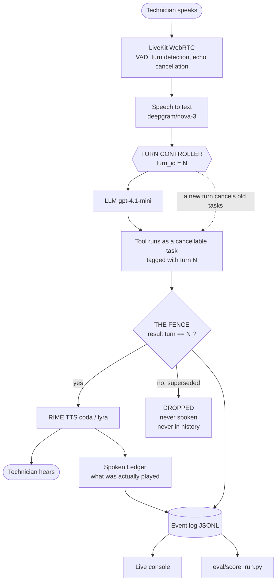

# Techbench — a voice agent that never speaks an answer you withdrew

A hands-busy voice assistant for field and counter work. Speech is the only interface. **Rime speaks every word — there is no TTS fallback.**

Built for DataForge 2026, Rime track. Hard voice problem: **interruption and recovery during in-flight tool work.**

---

## 1. What it can do

### Interruption and recovery ⭐ *the claimed capability*

Cut it off mid-sentence and change your mind. Playback stops, the abandoned work is cancelled, and — the part almost nobody handles — **any result that comes back for the turn you withdrew is dropped before it can be spoken or written into conversation history.**

> **Claim.** Stopping playback is easy. Keeping application state consistent with what the user *actually heard* is not.

**Measured: 0 stale results spoken in 20 trials. Remove the mechanism and it leaks 20 out of 20.**

### Continuous conversation during tool work

The session stays open while a lookup runs. You can add a constraint, ask for status, change the request, or cancel — mid-flight, while Rime is still speaking. Full duplex is treated as a property of the whole application, not of the TTS.

### Business enquiries, answered from your documents

Ask about hours, delivery, returns, warranty, payments or escalation. Answers come from the business's own files — **never from the model's memory.** Below a confidence floor it says *"I don't have that in our records, I can take a message"* and offers escalation. A confident wrong answer about a refund policy is worse than no answer.

Every spoken answer traces to the exact source line that produced it.

### Feed it your documents

Drop a **PDF**, `.md` or `.txt` into `kb/`, or upload it in the web console. Picked up on the next question — no restart. A scanned PDF with no text layer is refused with a clear message rather than silently adding nothing.

You can also correct it by voice: *"Remember we're closed on the twenty-fifth of December."* Written to disk, live for the next caller.

### Multilingual

English, **Hindi**, Spanish and French. It switches Rime's language *and* speaker mid-session, using voices pulled from Rime's live catalog rather than a hardcoded list.

### It can write programs

Hand it a coding task and it delegates to Claude Code headless: *"Write a python function that reverses a string and save it to utils.py."* Real files, written to a sandbox, with a spoken summary back.

Tools granted: **Read, Write, Edit, Glob, Grep — never Bash.** Speech recognition is lossy and must not reach a shell.

### It can create applications

*"Make me a python project called scraper."* Real folders and files on disk — `main.py`, `requirements.txt`, `README.md`, or `index.html` / `style.css` for a web project.

### It can operate your computer

Opens Claude Code, VS Code, Notepad, Calculator, File Explorer, the terminal or a browser. **Allowlist only** — anything else is refused out loud, naming what *is* available.

### It can draft email

Composes a customer reply and writes a real `.eml` to `drafts/`, addressed and ready. **It never sends.** A misheard recipient in a sent email is unrecoverable, so a human reviews and sends. The agent holds no mail credentials.

### Live web search

Real network work, roughly 2 seconds — long enough to be genuinely interrupted, which is why it doubles as the stress case.

### Observability

An append-only JSONL event log records every turn, barge-in, cancellation, dropped result and latency reading. The browser console tails it live; the scorer reads the same file afterwards. **The demo and the evidence come from identical data.**

### An MCP server

Any MCP client — Claude, Cursor, an internal tool — can connect to the same knowledge base, drafts and call telemetry without touching the voice interface.

```
claude mcp add --transport stdio techbench -- python mcp_server.py
```

Exposed: `kb_search` · `kb_add` · `kb_stats` · `draft_email` · `list_drafts` · `call_metrics`.
**Not exposed:** sending mail, shell access, launching applications — an MCP client is another unattended caller.

---

## 2. Latency

Measured across a live 1731-event session, using LiveKit's own instrumentation rather than our timers.

| Hop | Median | n |
|---|---|---|
| End-of-utterance detection | 948 ms | 139 |
| Transcription | 385 ms | 139 |
| LLM first token | 1143 ms | 185 |
| **Rime time-to-first-byte** | **369 ms** | 189 |
| Time to silence on barge-in | 1053 ms | 6 |

**Rime is the fastest hop in the pipeline**, despite being the furthest away.

### Why the numbers look like this

DNS resolves both Rime hosts to **AWS us-west-2 (Oregon)**. From India that imposes a **~270 ms round-trip floor**, and no APAC endpoint is published. One-shot HTTP measured ~915 ms TTFB warm, of which ~547 ms was TCP+TLS. The shipped path holds a persistent WebSocket, which is why in-session TTFB is 369 ms — the handshake is paid once per session, not per utterance.

### The model was chosen by measurement

TTFT benchmark from India, n=3 each (`eval/llm_latency.py`):

| Model | Median TTFT |
|---|---|
| `openai/gpt-oss-120b` | 908 ms |
| `openai/gpt-4.1-nano` | 1064 ms |
| **`openai/gpt-4.1-mini`** *(shipped)* | 1134 ms |
| `google/gemini-3.1-flash-lite` | 1193 ms |
| `xai/grok-4-1-fast-non-reasoning` | 4647 ms |

The model branded *"fast"* was five times slower than the fastest. `gpt-4.1-mini` ships because it is the configuration verified across the full recorded session; stability was preferred over ~200 ms.

---

## 3. How it works



### What happens when you interrupt

```
t=0.0   turn 12 opens. "Search for Dragon Hatchling" dispatched, tagged 12.
t=0.4   Rime is speaking.
t=1.0   You barge in: "No, search for Rime latency instead."
        -> playback stops
        -> turn 13 opens, every task tagged 12 is cancelled
t=2.0   The turn-12 search finishes anyway. It returns tagged 12.
        -> 12 != 13  ->  DROPPED. Never spoken. Never in history.
t=2.1   The turn-13 search passes the fence and is spoken.
```

The mechanism, in full ([`fence.py`](fence.py)):

```python
def accept(self, result: Fenced, what: str) -> bool:
    if result.turn_id != self._turn_id:
        self.log.emit("fence_drop", ...)
        return False          # superseded - never spoken, never committed
    return True
```

It is tool-agnostic. The agent grew from two tools to nine without one line of new interruption logic.

---

## 4. Evidence

| Condition | Stale results spoken |
|---|---|
| Fencing enabled | **0 / 20** |
| Fencing disabled — ablation, one line removed | **20 / 20** |

Correction handling 20/20. Entity tracking 20/20. Zero leaks in each of the four interruption types.

Barge-in injected 3.0s into the agent's turn, tool delay fixed at 3.0s so the interruption lands mid-flight. Reproducible offline in one second:

```
python eval/run_bargein.py
```

**The fence fired on the real audio path.** In the live session, 17 tool results returned, 16 were committed and 1 was dropped:

```
fence_drop  what=web_search  result_turn=12  current_turn=13
```

Full method, procedure and limitations: **[RIME_EVIDENCE.md](RIME_EVIDENCE.md)**.

---

## 5. Rime configuration

| Field | Value |
|---|---|
| Model | `coda` |
| Speaker | `lyra` |
| Language | `eng` (switchable `hin`, `spa`, `fra`) |
| Endpoint | `wss://users-ws.rime.ai` (streaming) |
| Audio format | PCM, 22050 Hz, mono |
| Transport | WebRTC via LiveKit Cloud, India South |
| Integration | `livekit-plugins-rime` 1.8.0, direct plugin, own API key |
| Controls | `speed_alpha=0.9` |

**No TTS fallback.** Rime is the only speech provider in the judged flow; if it fails the agent is silent. The active provider is displayed in the console header at all times.

### Pronunciation was measured, not assumed

Checked with Rime's own `normalize_text` and `check_dictionary` before writing any fix (transcript in [`eval/pronunciation_check.md`](eval/pronunciation_check.md)):

- Part codes need no intervention — Rime already renders `HP-4412` as *"H-P, four four one two"*. A hand-written spoken-form map was written, tested, found redundant and **deleted**.
- The real risk is domain vocabulary: `viton`, `ptfe`, `vx` are out-of-dictionary. A mispronounced seal material means the technician fits the wrong part.

---

## 6. Coverage of the brief's voice problems

One problem is claimed and measured. The others are product quality, reported without a claim.

| Voice problem | Status |
|---|---|
| **Interruption and recovery** | **claimed + measured** — fencing, ablation, live drop |
| Conversation continuity during tool work | built |
| Perceived response time | instrumented across five hops; geography analysed, not optimised |
| Pronunciation and controlled delivery | evidence-driven, before/after on disk |
| Multilingual and code-switched speech | built — eng / hin / spa / fra |
| Evaluation and observability | built — event log, console, scorer, ablation harness, MCP server |
| Expressive and persistent voice identity | partial — one voice, one persona, consistent across turns |
| Telephony and adverse audio | **not attempted** — no SIP trunk, and browser-mic results do not prove telephone performance |

---

## 7. Setup

```
py -3.12 -m venv .venv
.venv\Scripts\python.exe -m pip install "livekit-agents[rime,openai]~=1.6" python-dotenv pypdf
copy .env.example .env
```

`.env` needs `RIME_API_KEY`, `LIVEKIT_URL`, `LIVEKIT_API_KEY`, `LIVEKIT_API_SECRET`. Never commit it; `.gitignore` excludes it.

**Terminal only** (simplest — local mic, no browser):

```
.venv\Scripts\python.exe agent.py console
```

**With the web console:**

```
.venv\Scripts\python.exe agent.py dev
.venv\Scripts\python.exe server.py
```

Open the URL the server prints, click **Connect mic**. Use a headset — on laptop speakers the agent hears itself and self-interrupts.

Test protocol: **[TESTING.md](TESTING.md)**.

---

## 8. Third-party services

| Service | Role | Key |
|---|---|---|
| **Rime** | text-to-speech, primary spoken output | yes |
| LiveKit Cloud | WebRTC transport, VAD, turn detection, barge-in, AEC | yes |
| `deepgram/nova-3` | streaming speech-to-text | via LiveKit Inference |
| `openai/gpt-4.1-mini` | reasoning | via LiveKit Inference |
| DuckDuckGo HTML | live web search | no |
| Claude Code CLI | delegated coding tasks | your own login |

---

## 9. What is live, synthetic or simulated

| Component | Status |
|---|---|
| Voice conversation, STT, LLM, Rime TTS | **live** |
| `search_web` | **live** — real network request, ~2s |
| `answer_enquiry` | **live** retrieval over **synthetic** business facts in `kb/` |
| `compose_email` | **live** — writes a real `.eml`; **never sends** |
| `open_application`, `make_project`, `delegate_task` | **live** — real processes, real files |
| `lookup_part` | **synthetic** data, **injected** 3.0s delay (the stress knob) |
| Latency figures | **measured**, from LiveKit's own instrumentation |
| 20-trial barge-in result | **logic level** — real fence objects, simulated timeline |
| Live-session figures | **measured**, single session, small n |

Nothing here is animated or scripted.

---

## 10. Known limitations and failure behaviour

- **The live fence sample is n=1.** Most interruptions are caught by cancellation before a result reaches the fence. The 20-trial ablation proves the mechanism; the live drop proves it fires on the real audio path.
- **The 20-trial result is logic-level.** It drives the real `TurnController`, `Fenced` and `SpokenLedger` objects on a simulated timeline. It proves the invariant; it does not measure acoustic timing.
- **Time-to-silence is noisy.** n=6, raw values `[544, 1563, 3857, 10446]` ms plus two spurious sub-millisecond readings. Median reported; exploratory, not a performance claim.
- **The Spoken Ledger records but does not diff.** `truncated_chars_total` is always 0 because `intended` and `spoken` are passed the same string. The interrupted flag is real; character-level truncation is not yet wired to playback position.
- **Latency is geography-bound.** Rime resolves to AWS us-west-2; from India there is a ~270 ms floor and no published APAC endpoint.
- **The pipeline fails outright rather than degrading.** On an unstable link a DNS failure takes down speech recognition, the model and Rime simultaneously — the agent goes silent rather than slowing down. Network stability, not model latency, is the binding constraint outside well-connected regions.
- **`livekit_ffi`'s bundled soxr resampler can abort the process** under concurrent audio-stream churn (`LSX_FFT_BR == NULL`, `fft4g_cache.h:13`; also `FFT_LEN == -1` at line 15 when a sample rate is forced). This is a vendor-library defect. Do **not** pass `sample_rate` to `rime.TTS`.
- **The delegated agent can report confidently and be wrong.** In testing it once claimed a file existed when the directory was empty. The bridge speaks its summary verbatim and does not verify it.
- **Keep the knowledge base clean.** Retrieval is TF-IDF, so a large unrelated document dominates by chunk count. During testing an unrelated 6 KB file contributed 50 of 83 chunks and started answering business questions from a code review. Only upload customer-facing business facts.
- **If Rime is unavailable the agent is silent** — by design, since a fallback provider would violate the requirement that Rime be the primary output.
- **Telephony is untested and not claimed.** The architecture is transport-agnostic (LiveKit supports SIP), but that is a statement of design, not a result.

---

## 11. Repository

```
agent.py       the voice agent: STT/LLM/TTS wiring, nine tools, event hooks
fence.py       TurnController, Fenced, SpokenLedger, EventLog
kb.py          retrieval over the business knowledge base (PDF/MD/TXT)
tools.py       live web search
pc.py          allowlisted application launching, project scaffolding
delegate.py    bridge to Claude Code headless
mail.py        email drafting (never sends)
mcp_server.py  MCP server exposing the business layer
server.py      LiveKit token minting, static serving, SSE event stream
web/           browser client + live metrics console
kb/            business documents - drop PDFs here
eval/
  run_bargein.py          20 trials + ablation (no microphone needed)
  score_run.py            scores a live audio session
  llm_latency.py          TTFT benchmark across models
  pronunciation_check.md  Rime normalize_text / check_dictionary evidence
  runs/                   event logs and result JSON
  audio/                  sample Rime output
```

---

## 12. Credits, licences and AI assistance

- Built on [LiveKit Agents](https://github.com/livekit/agents) (Apache-2.0).
- Speech synthesis by [Rime](https://rime.ai).
- Prior art and terminology from the papers listed in [RIME_EVIDENCE.md](RIME_EVIDENCE.md). Those citations were located by search and used for protocol and vocabulary; they are not reproduced.
- **AI assistance:** built with Claude Code. Architecture, scoping and code were produced in dialogue; the author reviewed, ran and can defend every component. The pronunciation map was written, tested against Rime's normalizer, found redundant and removed — an example of the review process rather than acceptance of generated output.
